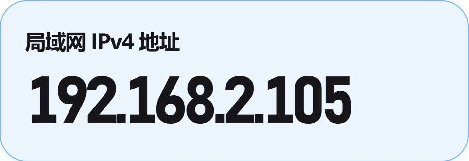
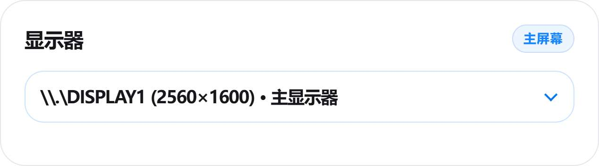
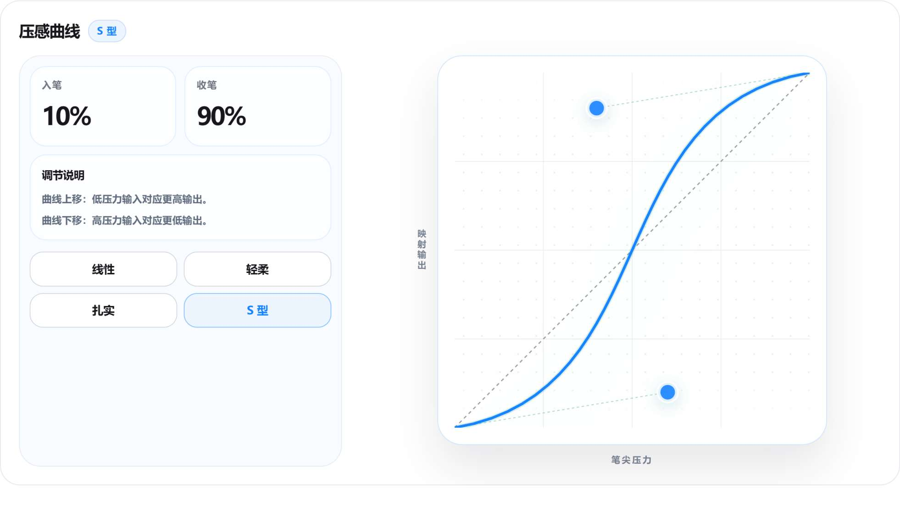
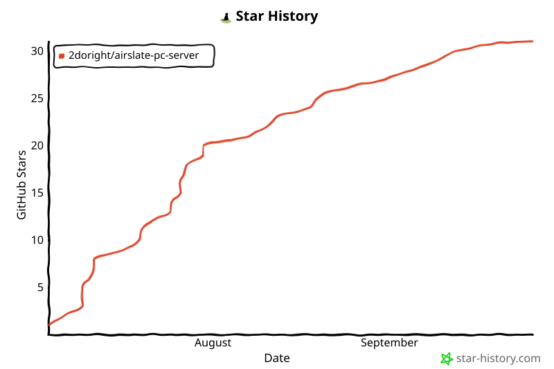

# AirSlate PC Server

将你的鸿蒙平板/手机转换为电脑的数位板

  

  

想法交流、提出建议或查找解决方案，可以前往 [Discussions](https://github.com/2doright/airslate-pc-server/discussions)。

   

## 开始使用

需下载安装 **鸿蒙端 AirSlate** 和 **GitHub Release 中的 PC Server** 后，再开始使用。

> [!TIP]
> 大多数连接问题都来自两端不在同一个局域网。优先确认电脑和鸿蒙设备连接的是同一个 Wi-Fi 或同一网络环境。

### 1. 安装或启动 PC Server

从 [GitHub Releases](https://github.com/2doright/airslate-pc-server/releases) 下载 PC 端程序。

发布包通常有两种形式：

| 类型 | 适合人群 |
| --- | --- |
| 安装版 `.msi` | 推荐大多数用户使用，安装后从开始菜单或桌面启动 |
| 便携版 `.zip` | 适合临时使用，解压后直接运行 |

启动 **AirSlate PC Server** 后，先停留在“连接”页。

### 2. 在鸿蒙端连接电脑

PC Server 的“连接”页会显示当前电脑的局域网 IPv4 地址。

在鸿蒙端 **AirSlate** 中输入此 IPv4 地址并连接。

> [!IMPORTANT]
> 如果电脑端显示了多个 IPv4 地址，请选择当前网络环境对应的地址。若连接失败，可以逐个尝试列表中的局域网地址。

### 3. 选择目标显示器

如果电脑连接了多块屏幕，请在 PC Server 中选择笔输入要映射到的显示器。

### 4. 开始书写

连接完成后，即可在鸿蒙端使用笔输入、点击和手势操作。第一次使用建议先保持默认预设，确认连接和落点正常后，再调整压感曲线与快捷键。

> [!IMPORTANT]
> 如果在绘图软件中可以移动光标但没有压感，请将绘图软件的输入设置切换为 **TabletPC / Windows Ink**。这适用于 CSP、SAI2 等默认使用 WinTab API 的软件。

## 功能说明

### 压感曲线

压感曲线用于调整“手上施加的压力”和“电脑端最终输出的压力”之间的关系。

| 预设 | 适合情况 |
| --- | --- |
| 线性 | 输入和输出保持接近，适合先做基准测试 |
| 轻柔 | 轻压更容易出笔，适合觉得默认太重的情况 |
| 扎实 | 需要更明确的压力才输出高压感，适合容易下笔过重的情况 |
| S 型 | 中段变化更明显，适合追求层次变化 |

> [!TIP]
> 不确定怎么调时，先从“线性”开始，再根据手感选择“轻柔”或“扎实”。

### 快捷键预设

快捷键页用于管理不同软件的手势和按键映射。

你可以在这里：

- 切换预设
- 新建预设
- 恢复预设默认值
- 录入快捷键组合
- 配置径向菜单外环与内环行为

建议为不同软件分别建立预设，例如：

- 绘画软件
- 笔记软件

### 手势与分类区域

当前支持的映射类别包括笔、点击、平移、捏合、旋转、速划和长按。

录入快捷键时，点击可编辑项后按下目标按键或组合键，松开后完成录入；再次点击当前项可取消。键盘按键可以清空，也可以与该手势支持的特殊动作同时使用。

编辑时会在当前项附近显示特殊动作选择器。可用项由手势的真实运行时能力决定，包括鼠标左/右键、按手势坐标移动、按住鼠标键移动、滚轮及旋转移动；选择特殊动作不会覆盖已经录入的键盘按键。

### 径向菜单

双指或三指平移可配置为呼出径向菜单，用于快速触发常用操作。

径向菜单包含：

- 内环：固定方向槽位，可直接交换位置
- 外环：每个方向可分别录入不同快捷键组合

如果关闭内环，触发径向菜单的平移手势会更直接地作用于外环快捷键。

## Star History

