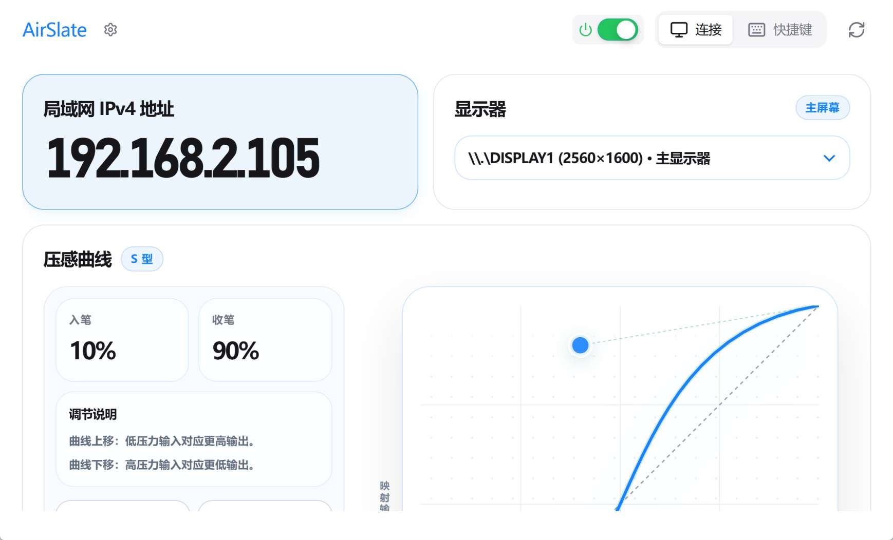
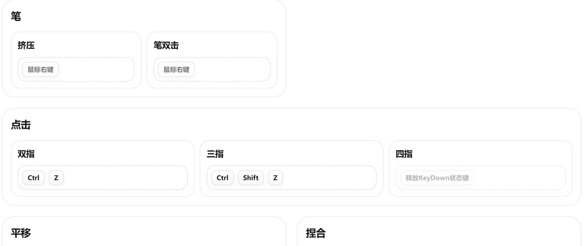
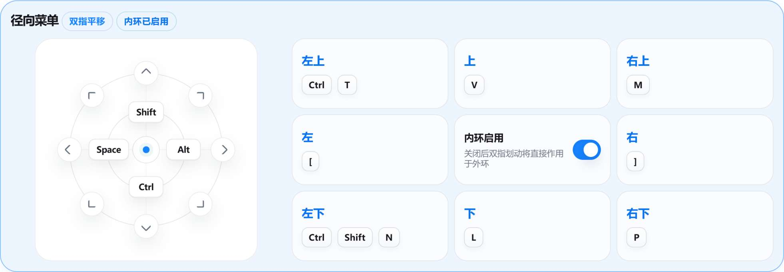

# AirSlate PC Server

将你的鸿蒙平板/手机转换为电脑的数位板

遇到 Bug 或异常行为，请在 [GitHub Issues](https://github.com/2doright/airslate-pc-server/issues) 提交问题。想交流想法、提出建议、关注开发动态、提出问题或查找解决方案，可以前往 [GitHub Discussions](https://github.com/2doright/airslate-pc-server/discussions)。

## 主要功能

- 在 Windows 绘画软件中使用鸿蒙平板/手机进行手写或绘制
- 将平板作为无线数位板使用
- 通过手势触发常用快捷键
- 在多显示器环境中指定输入映射到某一块屏幕
- 为不同软件配置不同的快捷键预设

## 功能概览

| 功能 | 说明 |
| --- | --- |
| 局域网连接 | 鸿蒙端输入电脑 IPv4 地址后连接 PC Server |
| 显示器映射 | 多屏环境下选择笔输入作用到哪一块显示器 |
| 压感曲线 | 使用预设或手动曲线调节压感手感 |
| 快捷键预设 | 为绘画、笔记、修图等软件分别保存快捷键方案 |
| 手势映射 | 支持点击、平移、捏合、旋转、速划、长按等映射 |
| 径向菜单 | 通过手势呼出快捷操作菜单，减少键盘依赖 |
| 开机启动 | 可随 Windows 启动并驻留托盘 |

## 开始使用指南

这一部分用于说明：当你已经下载好 **鸿蒙端 AirSlate** 和 **GitHub Release 中的 PC Server** 后，应该如何开始使用。

### 1. 准备设备

请先确认：

- Windows x64 系统
- 可正常运行 WebView2
- 安装鸿蒙端应用 **AirSlate**
- 下载并安装或解压 **AirSlate PC Server**
- Windows 电脑和鸿蒙设备处于同一个局域网

> [!TIP]
> 大多数连接问题都来自两端不在同一个局域网。优先确认电脑和鸿蒙设备连接的是同一个 Wi-Fi 或同一网络环境。

### 2. 安装或启动 PC Server

从 [GitHub Releases](https://github.com/2doright/airslate-pc-server/releases) 下载 PC 端程序。

发布包通常有两种形式：

| 类型 | 适合人群 |
| --- | --- |
| 安装版 `.msi` | 推荐大多数用户使用，安装后从开始菜单或桌面启动 |
| 便携版 `.zip` | 适合临时使用，解压后直接运行 |

启动 **AirSlate PC Server** 后，先停留在“连接”页。

### 3. 在鸿蒙端连接电脑

PC Server 的“连接”页会显示当前电脑的局域网 IPv4 地址。

在鸿蒙端 **AirSlate** 中输入这个 IPv4 地址并连接。

> [!IMPORTANT]
> 如果电脑端显示了多个 IPv4 地址，请选择当前网络环境对应的地址。若连接失败，可以逐个尝试列表中的局域网地址。

### 4. 选择目标显示器

如果电脑连接了多块屏幕，请在 PC Server 中选择笔输入要映射到的显示器。

建议：

- 单显示器：保持默认即可
- 双屏或多屏：先选择绘图软件所在的屏幕
- 更换显示器布局后：重新确认一次映射目标

### 5. 开始书写

连接完成后，即可在鸿蒙端使用笔输入、点击和手势操作。第一次使用建议先保持默认预设，确认连接和落点正常后，再调整压感曲线与快捷键。

> [!IMPORTANT]
> 如果在绘图软件中可以移动光标但没有压感，请将绘图软件的输入设置切换为 **TabletPC / Windows Ink**。这适用于 CSP、SAI2 等默认使用 WinTab API 的软件。

## 功能说明

### 连接页

连接页用于查看电脑局域网地址、选择显示器、调节压感曲线。

常用检查顺序：

1. 确认 IPv4 地址已显示
2. 确认鸿蒙端输入的 IP 与电脑端一致
3. 确认目标显示器选择正确
4. 确认压感曲线是否符合当前软件手感

### 压感曲线

压感曲线用于调整“手上施加的压力”和“电脑端最终输出的压力”之间的关系。

| 预设 | 适合情况 |
| --- | --- |
| 线性 | 输入和输出保持接近，适合先做基准测试 |
| 轻柔 | 轻压更容易出笔，适合觉得默认太重的情况 |
| 扎实 | 需要更明确的压力才输出高压感，适合容易下笔过重的情况 |
| S 型 | 中段变化更明显，适合追求层次变化 |

> [!TIP]
> 不确定怎么调时，先从“线性”开始，再根据手感选择“轻柔”或“扎实”。

### 快捷键预设

快捷键页用于管理不同软件的手势和按键映射。

你可以在这里：

- 切换当前预设
- 新建自己的预设
- 恢复当前预设的默认值
- 录入新的快捷键组合
- 配置径向菜单外环与内环行为

建议为不同软件分别建立预设，例如：

- 绘画软件
- 笔记软件
- 修图软件
- 演示或白板软件

### 手势与分类区域

当前支持的映射类别包括笔、点击、平移、捏合、旋转、速划和长按。

录入快捷键时，点击可编辑项后按下目标按键或组合键，松开后完成录入；再次点击当前项可取消。键盘按键可以清空，也可以与该手势支持的特殊动作同时使用。

编辑时会在当前项附近显示特殊动作选择器。可用项由手势的真实运行时能力决定，包括鼠标左/右键、按手势坐标移动、按住鼠标键移动、滚轮及旋转移动；选择特殊动作不会覆盖已经录入的键盘按键。

### 径向菜单

双指平移支持呼出径向菜单，用于快速触发常用操作。

径向菜单包含：

- 内环：固定方向槽位，可直接交换位置
- 外环：每个方向可分别录入不同快捷键组合

如果关闭内环，双指划动会更直接地作用于外环快捷键。

## 使用建议

第一次使用时，推荐按这个顺序设置：

1. 先确认 PC 端和鸿蒙端连接正常
2. 选择目标显示器
3. 使用默认预设体验一次
4. 根据常用软件调整快捷键
5. 最后再微调压感曲线

这样更容易判断问题来自连接、显示器映射、压感设置，还是快捷键映射。

## 常见问题

### 鸿蒙端连接不上

请依次确认：

- PC Server 已经启动
- 电脑和鸿蒙设备处于**同一个局域网**
- 没有选到虚拟网卡、热点、代理或其他无关网络地址
- 鸿蒙端上次使用时，没有异常退出（如直接退后台）

### 多显示器场景下，落笔位置不对

在 PC Server 的“连接”页重新选择目标显示器。更改 Windows 显示器排列后，也建议重新确认一次。

### 绘图软件没有压感

请在绘图软件中将输入 API 或平板设置切换为 **Windows Ink** （应用中可能使用了其它名称，如TabletPC）。

这类问题常见于 CSP、SAI2 等默认使用 WinTab API 的软件。AirSlate PC Server 输出的是 Windows 笔输入事件，因此绘图软件需要使用 Windows Ink 输入API才能正确接收压感。

### 可以同时连接多台鸿蒙设备吗

当前只支持连接一台 AirSlate 设备。

## 项目链接

- 鸿蒙端下载：[华为应用市场](https://appgallery.huawei.com/app/detail?id=com.walkshadow.airslate&channelId=SHARE&source=appshare)
- PC 端下载：[GitHub Releases](https://github.com/2doright/airslate-pc-server/releases)
- 介绍讲解视频：[Bilibili](https://www.bilibili.com/video/BV1nkMi6fEXA)
- Bug 反馈：[GitHub Issues](https://github.com/2doright/airslate-pc-server/issues)
- 交流讨论：[GitHub Discussions](https://github.com/2doright/airslate-pc-server/discussions)

## Star History

