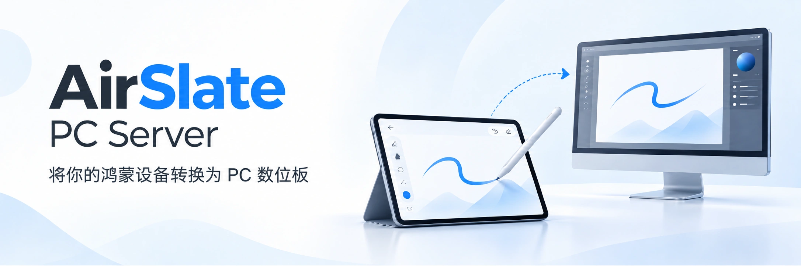

<picture>
  <source media="(prefers-color-scheme: dark)" srcset="assets/banner-dark.webp">
  <source media="(prefers-color-scheme: light)" srcset="assets/banner-light.webp">
  
</picture>

<br>

[](https://github.com/2doright/airslate-pc-server/releases) [](https://github.com/2doright/airslate-pc-server/releases) [](LICENSE) [](https://appgallery.huawei.com/app/detail?id=com.walkshadow.airslate&channelId=SHARE&source=appshare)

[](https://github.com/2doright/airslate-pc-server/discussions/23) [](https://github.com/2doright/airslate-pc-server/discussions)

## 快速开始

[视频指南](https://www.bilibili.com/video/BV1nkMi6fEXA) · [Bilibili 主页](https://space.bilibili.com/663096739) · [小红书主页](https://www.xiaohongshu.com/user/profile/655c2ab1000000000202b57e)

当前提供无线、有线两种连接方式。无线通过 IP 建立连接，有线使用数据线连接。

1. 下载安装 [AirSlate](https://appgallery.huawei.com/app/detail?id=com.walkshadow.airslate&channelId=SHARE&source=appshare) 和 [PC Server](https://github.com/2doright/airslate-pc-server/releases) 。
2. PC Server“无线连接”页会显示当前电脑的局域网 IPv4 地址。在鸿蒙端 **AirSlate** 中输入此 IPv4 地址并连接。

   

   > 多数无线连接问题都来自两端不在同一个局域网。优先确认电脑和鸿蒙设备处于同一网络环境，或网络开启了隔离。

3. 连接完成后，鸿蒙端跳转到数位板界面，即可开始数位板的体验。

   > 如果在绘图软件中可以移动光标但没有压感，请将绘图软件的输入设置切换为 **TabletPC / Windows Ink**。这适用于 CSP、SAI2 等默认使用 WinTab API 的软件。

## 平台支持

| 平台 | 无线连接 | 有线连接 | 安装包 |
| --- | --- | --- | --- |
| Windows | ✅ | ✅ | `.msi` 安装版 / `.exe` 便携版 |
| macOS | ✅ | ✅ | Universal `.dmg` / `.app.zip` |
| Linux | ✅ | ✅ | `deb` / `rpm` / `AppImage` |

三个平台的笔输（压感、倾斜、笔按键）与快捷键行为一致。Linux 通过 uinput 虚拟平板注入输入，覆盖 GNOME/KDE 的 X11 与 Wayland 会话。

### ⚠️ Linux 用户请注意

首次使用前需要两步系统级配置（Windows、macOS 无需）：

1. **输入注入**：将用户加入 `input` 组并重新登录，否则无法创建虚拟平板设备。

   ```bash
   sudo usermod -aG input $USER
   ```

2. **有线连接**（使用数据线连接时）：授权 USB 设备，并阻止 ModemManager 探测华为接口（否则平板每数秒重连，无法稳定连接）。

   ```bash
   sudo tee /etc/udev/rules.d/91-airslate-usb.rules > /dev/null <<'EOF'
   SUBSYSTEM=="usb", ATTR{idVendor}=="12d1", ENV{ID_MM_DEVICE_IGNORE}="1", MODE="0660", GROUP="input"
   SUBSYSTEM=="usb", ATTR{idVendor}=="18d1", ENV{ID_MM_DEVICE_IGNORE}="1", MODE="0660", GROUP="input"
   EOF
   sudo udevadm control --reload-rules && sudo udevadm trigger --subsystem-match=usb
   ```

   写入规则后重新插拔平板即可。

> NVIDIA 专有驱动 + Wayland 用户：程序已自动处理该兼容问题，无需任何设置。若仍遇到窗口不显示（日志出现 `Error 71`），可尝试启动时手动加环境变量 `WEBKIT_DISABLE_DMABUF_RENDERER=1`；Intel/AMD 无需此变量。

## ✨功能

### 压感曲线

压感曲线用于调整“手上施加压力”和“输出压力”之间的关系。曲线两端可手动调节。


| 预设 | 适合情况 |
| --- | --- |
| 线性 | 输入和输出保持接近，适合先做基准测试 |
| 轻柔 | 轻压更容易出笔，适合觉得默认太重的情况 |
| 扎实 | 需要更明确的压力才输出高压感，适合容易下笔过重的情况 |
| S 型 | 中段变化更明显，适合追求层次变化 |

### 快捷键

快捷键页用于管理不同软件的手势和按键映射。


可以为不同软件分别建立预设，录入快捷键组合，配置径向菜单外环与内环行为。

当前支持的映射类别包括笔、点击、平移、捏合、旋转、速划和长按。


录入快捷键时，再次点击当前项可取消。录入时可额外配置特殊动作，可用项由手势能力决定，包括鼠标左/右键、按手势坐标移动、按住鼠标键移动；

### 径向菜单

双指或三指平移可配置为呼出径向菜单，用于快速触发常用操作。


径向菜单包含：

- 内环：固定方向槽位，可直接交换位置
- 外环：每个方向可分别录入不同快捷键组合

如果关闭内环，触发径向菜单的平移手势会更直接地作用于外环快捷键。

## Star History

[](https://www.star-history.com/?repos=2doright%2Fairslate-pc-server&type=date&legend=top-left)
